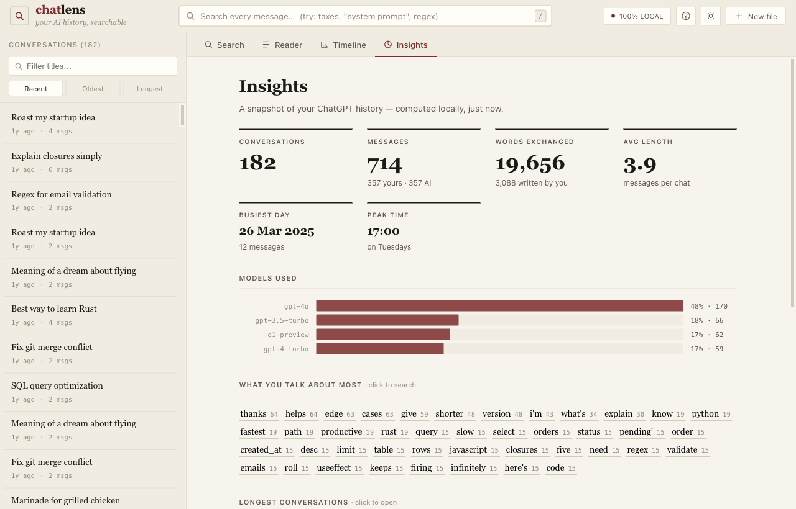
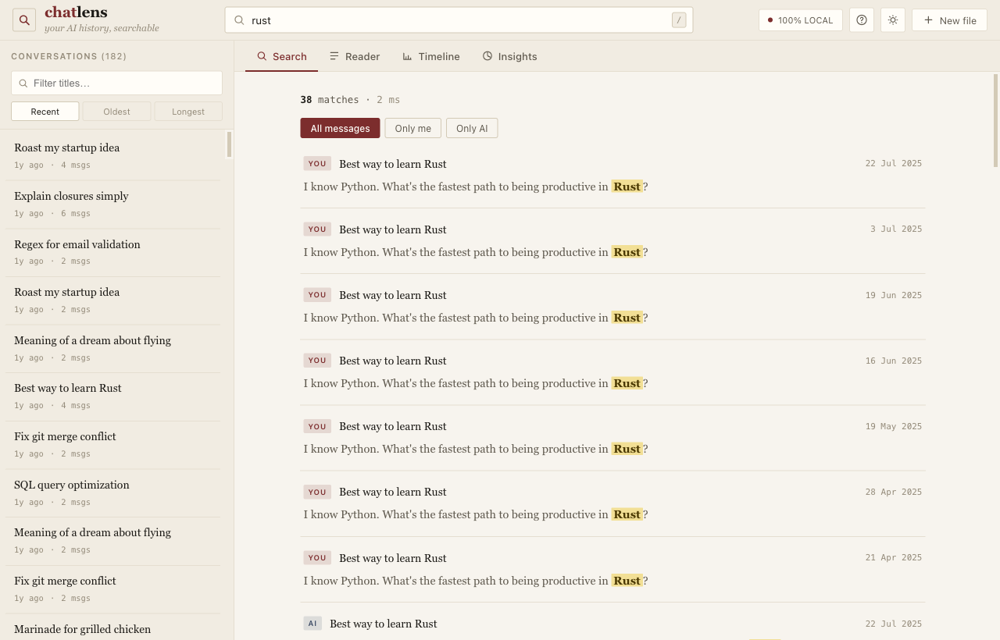

# chatlens

**Explore your ChatGPT & Claude history — 100% in your browser.**

Drop your export and instantly get full-text search, a usage timeline, per-topic
insights, and a clean reader across thousands of chats. Nothing is uploaded,
tracked, or stored. Everything runs on your device.

> *Screenshots use built-in sample data. Your real conversations never leave your browser.*

## Why

You know you asked your AI *that one thing* back in March — but the official apps
give you no real search and no way to see your own history. chatlens turns your
data export into something you can actually explore.

## Use it

It's a **single HTML file with no build step and no dependencies.**

- **Just open it:** double-click `index.html` (works offline, straight from disk), or
- **Serve it:** `python3 -m http.server` then visit the printed URL, or host the one
  file anywhere static (GitHub Pages, Netlify, an S3 bucket…).

Then load your export, or click **Explore with sample data** to try it with a
synthetic dataset — no export needed.

## Loading your export

chatlens accepts three shapes, auto-detected:

1. **A single `conversations.json`** — the standard ChatGPT/Claude export. Drop it or click to choose.
2. **A folder of per-conversation files** — some ChatGPT exports split each chat into
   its own `.json`. Drag the whole folder onto the page, or use **"select a whole folder."**
3. **Multiple files at once** — select any number of `.json` files together.

**Getting the export**

- **ChatGPT** → Settings → Data controls → Export data → unzip the emailed archive.
- **Claude** → Settings → Privacy → Export data → unzip.

Both provider formats are detected automatically. chatlens reconstructs each
conversation's canonical thread (following the active branch), so regenerated /
edited-away branches are excluded from counts — you see the conversation as it stands.

## Performance

Everything is indexed in-browser in a background Web Worker, so the UI never freezes.
Measured on desktop Chrome (M-class laptop):

| Export size | Conversations | Messages | One-time index | Search |
|---|---|---|---|---|
| 30 MB (real export) | 222 | 4,362 | ~1.9 s | 6–15 ms |
| 53 MB (synthetic) | 2,446 | 50,000 | ~7.8 s | ~70 ms |
| 85 MB (synthetic) | 4,857 | 100,000 | ~13 s | ~120 ms |

- **Indexing is a one-time cost on load**, shown with a progress bar, and scales roughly
  linearly with total text. **Search stays fast** (well under a quarter-second) even when
  a query matches tens of thousands of messages.
- **Honest ceiling:** past ~100k messages / a few hundred MB, indexing runs into the tens
  of seconds and memory use climbs (the index keeps a lowercased copy of message text, so
  peak RAM is a small multiple of the file size). It's built for real personal histories —
  thousands to ~100k messages — not for indexing a shared multi-account archive. Extremely
  large exports may be slow or memory-bound on low-RAM devices.

## Features

- **Full-text search** across every message, built as an in-browser inverted index.
  - Multi-word queries match messages containing **all** the words.
  - `"quoted phrases"` for exact matches.
  - `/regex/` for regular expressions (e.g. `/colou?r/`).
  - Filter by **you** vs **the AI**, and jump straight from a result into the reader.
- **Timeline** — messages per month, plus a day-of-week × hour-of-day heatmap.
- **Insights** — totals, words written, busiest day, peak hour, models used, longest
  conversations, and what you talk about most.
- **Reader** — a clean serif reading view of any conversation with lightweight Markdown
  (code blocks, lists, bold, links) and per-message model labels.
- **Light & dark themes** (paper by default; a warm "reading at night" dark mode).

## Privacy & architecture

- **No backend, no network calls.** Open your browser's Network tab, or disconnect
  from the internet — it works the same. Reload the tab and all data is gone.
- Parsing and indexing run in a **Web Worker**; the main thread only renders. If a browser
  blocks Blob-URL workers (some `file://` setups), it transparently falls back to a
  same-interface main-thread parser.
- The web client is a single vanilla HTML/CSS/JS file — easy to audit end to end.

## Non-goals

No cloud, no LLM calls, no "continue this chat." chatlens reads and understands your
existing history; it doesn't talk to any model.

## License

MIT
